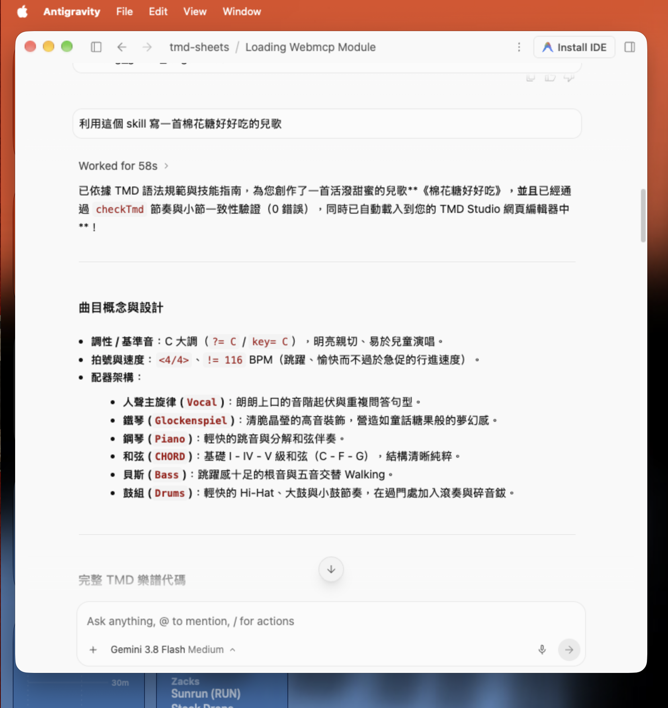
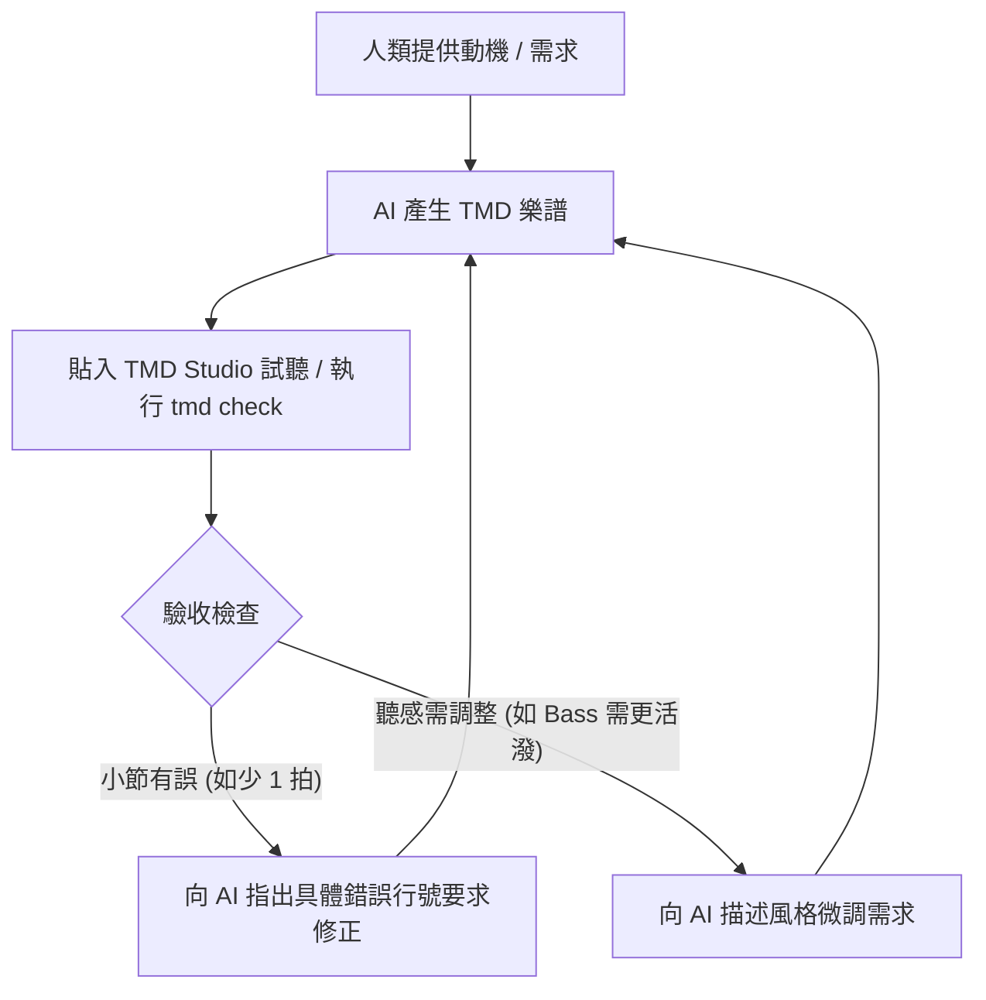

# AI 協同寫歌

無論使用 ChatGPT、Claude、Google Gemini，或終端機與編輯器中的 AI 助手（如 Claude Code、Cursor、GitHub Copilot、Antigravity），**純文字 TMD 都是人類與 AI 的理想音樂協作語言**。

傳統格式（如 MusicXML 或 LilyPond）充斥繁瑣排版標籤，AI 容易遺漏括號或計算錯誤，人類也難以一眼看懂；Suno、Udio 等波形生成工具則是黑盒子，無法依照腦中的旋律局部微調。TMD 以「首調唱名（簡譜）」與「模組化段落」為核心，讓你像 Pair Programming（結對編程）一樣與 AI 逐句寫歌。



## 準備工作：讓 AI 理解 TMD 語法

大型語言模型雖具備樂理知識，預設卻不一定熟悉 TMD 最新語法（如升降記號順序 `1'^` 或樂軌進入位移 `@|+4|`）。

### 方法 A：直接複製 TMD 規範給 AI（最簡單）

開始聊天時，將 [TMD 語法規格](syntax.md) 的重點或專案中的 `SKILL.md` 貼給 AI。

### 方法 B：一鍵安裝 AI Agent Skill / MCP（進階使用者）

如果使用本地 Agent（Claude Code、Cursor、Gemini CLI、Antigravity 等）：

```bash
# 自動安裝官方 Skill 至本機 AI Agent 目錄
tmd --install-skills

# 註冊 MCP Server，讓 AI 能直接呼叫 tmd check / inspect
tmd --install-mcp
```

## 人機協同寫歌模式

### 模式一：你出旋律，AI 幫你自動配器（Lead-to-Arrangement）

這是最常見的寫歌場景：哼出或寫好主歌旋律，讓 AI 加上和弦吉他、貝斯與鼓組。

!!! example "你的 Prompt"
    「這是我寫好的主歌主旋律（TMD 格式）：
    ```tmd
    verse:Vocal@|0|{
    <4*>
    3 5 6 1^ 5 - 3 -
    2 3 5 2 1 - - -
    }
    ```

    請幫我為這個段落配器：
    1. 新增一個 `CHORD` 軌道，彈奏木吉他和弦。
    2. 新增一個 `Bass` 軌道，彈奏根音與經過音。
    3. 新增一個 `Drums` 爵士鼓組，並在第 2 小節以 `@|+2|` 的位移進場。
    請直接輸出完整的 TMD 段落。」

### 模式二：靈感卡住時，用短動機讓 AI 延伸樂句（Motif Continuation）

腦中常冒出一段 2 小節的旋律，卻不知道副歌或主歌該如何延續？

!!! example "你的 Prompt"
    「我有一個 2 小節的動機：`1 2 3 5 | 6 5 3 -`（4/4 拍，`<4*>` 網格）。請運用古典作曲的『問答樂句（問句與答句）』技巧，幫我把它發展成一個完整的 8 小節 A 段旋律，並在第 8 小節穩定終止在主音 `1`。」

### 模式三：探索不同曲風的和弦重配（Re-Harmonization）

TMD 的和弦使用獨立標記 `[Cmaj7]`、`[1]`、`[6m]`，可讓 AI 針對同一段旋律提出不同曲風的和聲方案。

!!! example "你的 Prompt"
    「這是我的副歌旋律：

    ```tmd
    chorus:Vocal@|0|{
        <4*>
        1^ - 7 5 | 6 - - - | 5 3 2 3 | 1 - - - |
    }
    ```

    請幫我設計兩種不同風味的和弦軌道（`chorus:CHORD@|0|`）：

    1. 第一種：經典流行抒情風（如 1-5-6-4 或 4-5-3-6-2-5-1 進行）。
    2. 第二種：帶有副屬和弦、借用和弦（Modal Interchange）與延伸和弦的 R&B / Neo-Soul 風格。」

### 模式四：動態層次鋪陳與進場安排（Textural Layering）

利用 TMD 的 `@|+N|`（小節延遲進場）與 `@|-1|`（弱起過門），讓 AI 製造情緒層次。

!!! example "你的 Prompt"
    「我正在規劃歌曲的結構動態，請幫我寫一個段落配置：

    - 主歌前半（第 1～4 小節）只有木吉他。
    - 第 5 小節 Bass 以 `@|+4|` 加入。
    - 在副歌進入前 1 小節，讓 Drums 以 `@|-1|` 演奏小鼓過門（Drum Fill）預備進入高潮。
    - 副歌所有人（Vocal, Guitars, Bass, Drums）全編制進場。」

### 模式五：規劃全曲行進與轉調升 Key（Macro Song Structuring）

各段落（`intro`、`verse`、`chorus`、`bridge`）完成後，讓 AI 排定播放順序與轉調。

!!! example "你的 Prompt"
     「我已經寫好了 `intro`、`verse`、`chorus`、`bridge` 與 `outro` 五個段落。
     請幫我設計一個符合現代流行歌起承轉合的 `-> ... ->#` 播放順序，並且在最後一次副歌前加上半音轉調 `{?+1}` 製造高潮。」

**AI 回應的流程**：

```tmd
-> intro 
-> verse -> chorus 
-> verse -> chorus 
-> bridge 
-> {?+1} -> chorus -> chorus 
-> outro ->#
```

## 人機協同的「即時試聽與除錯迴圈」

在 Chat AI 中寫歌，關鍵是形成 **「Prompt ➔ 生成 ➔ 試聽驗證 ➔ 回饋修正」** 的閉環：



### 常見修正 Prompt 範例

- **小節長度自動修復**：
!!! example "你的 Prompt"
    「剛才生成的樂譜在 `tmd check` 時回報第 8 行短少了 1 拍（Expected 4, found 3），請檢查並在適當位置加上延音線 `-` 或休止符 `0` 補足拍數。」
- **歌手音域微調**：
!!! example "你的 Prompt"
    「剛剛跑了 `tmd inspect`，最高音到了 `A5`，對我的歌手太高了。請將副歌的最高音控制在 `F5` 以內，改寫旋律走向。」
- **織體衝突修正**：
!!! example "你的 Prompt"
    「小提琴副旋律在第 3 小節跟人聲打架了，請讓小提琴在人聲唱長音的時候再穿插進來。」

## 實戰提示詞模板（Prompt Cheat Sheet）

| 創作任務 | 推薦 Prompt 模板 |
| :--- | :--- |
| **寫副旋律（Counter-Melody）** | `這是我的主旋律 verse:Vocal，請幫我寫一軌 verse:Flute@|0| 副旋律，在人聲停頓的空檔穿插裝飾，不要和人聲打架。` |
| **自動 Walking Bass** | `針對以下和弦進行 [2m7] [5] [1maj7]，在 <4*> 網格下寫出富有律動的爵士 Walking Bass 旋律。` |
| **副歌變奏（Variation）** | `請保留 chorus:Vocal 的主幹，寫一個 chorus_var:Vocal 變奏，加入高八度音點 (^) 與三連音 (1 2 3)%(--) 作為情緒爆發點。` |
| **二部合音（Harmony）** | `請針對這段旋律，自動生成一軌在上方三度或下方六度平行的二部合音軌道 verse:Harmony@|0|。` |
| **4/4 改 3/4 拍（華爾滋化）** | `請將這首 4/4 拍歌曲改編成 3/4 拍華爾滋節奏，拍號改為 <3/4>，伴奏改為 1 拍重音 + 2 拍輕音的經典舞曲律動。` |
