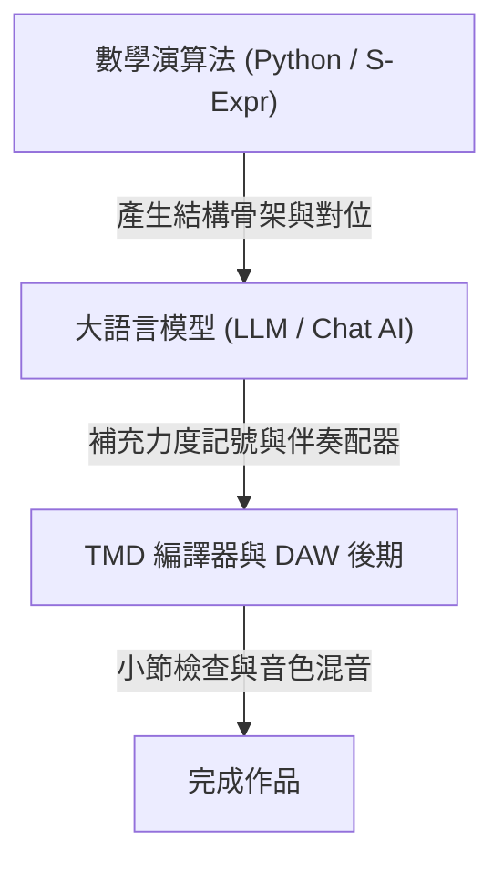

# 演算法生成音樂

在生成式 AI（LLM、Diffusion）大行其道之前，電腦音樂領域早在數十年前就發展出極為嚴謹的**演算法音樂（Algorithmic Composition）**。

從巴哈時代的數學對位法、莫札特的「音樂擲骰子遊戲（Musikalisches Würfelspiel）」，到現代的細胞自動機（Cellular Automata）與馬可夫鏈（Markov Chain），音樂本質上就蘊含著高度的數學結構。

TMD 是一套純文字的音樂記譜語法，這意味著：**你不一定要依賴 AI 大模型，只要用傳統的程式語言（Python、JavaScript、Swift）或是 TMD 內建的 S-Expression 巨集，就能寫出完全確定、可控、且富有數學美感的生成音樂！**

## 為什麼使用傳統演算法生成音樂？

相較於黑盒子機率模型，確定性演算法具有以下特性：

1. **確定性與可重現（Deterministic）**：相同的種子（Seed）或公式會產生完全一致的音符與節奏。
2. **免算力與低延遲**：不需要 GPU 算力或網路 API，直接透過本機腳本即可快速運算大量小節。
3. **精確的數學對位邏輯**：卡農（Canon）、賦格（Fugue）、碎形幾何或費氏數列等具備明確規則的音樂結構，適合直接透過演算法邏輯表達。

## TMD 內建的 S-Expression 巨集

TMD 內建了函數式巨集語法（S-Expression Macro），可直接在樂譜中透過代數轉換語法實現對位變換：

### 嚴格卡農對位（Canon）

在古典音樂中，卡農是指多個聲部演奏同一個主題，但各聲部在時間上依序錯開進場（如著名的帕海貝爾《D 大調卡農》）：

```tmd
::SCORE::
** Algorithmic Canon in D **
!= 60
?= D
<4/4>

/* 定義 4 小節抽象卡農主題（不綁定樂器） */
Theme {
    <4*>
    3^ 2^ 1^ 7 | 6 5 6 7 | 1^ 7 6 5 | 4 3 4 2 |
}

/* 一行指令：三把小提琴各間隔 2 小節嚴格進場，編譯器自動計算小節對齊 */
-> (canon Theme (Violin1 Violin2 Violin3) 2) ->#
```

在 Web Studio 中，也提供了一套卡農產生工具。

### 數學變形運算（Inversion, Retrograde, Transpose）

TMD 巨集支援古典巴洛克與十二音技法（Serialism）的核心數學變換：

| 運算子 | 語法範例 | 數學意義 |
| :--- | :--- | :--- |
| **`transpose`（移調）** | `(transpose Theme +7)` | 所有音符音高加上 7 個半音（純五度平移）。 |
| **`reverse`（逆行）** | `(reverse Theme)` | 將旋律在時間軸上**完全倒著演奏**（倒帶）。 |
| **`flip`（倒影 / 鏡射）** | `(flip Theme)` | 以第一個音為對稱軸，向上跳音改為向下跳音（垂直鏡射）。 |
| **`minor` / `major`** | `(minor Theme)` | 將原本大調音階在自然音級上映射為平行小調。 |
| **`vary`（複合管線）** | `(vary Theme +7 reverse minor)` | 函數管線組合：移調 ➔ 逆行 ➔ 小調化。 |

### 聲部層疊與固定低音循環（Layer & Loop）

你可以將數學變形後的主題與固定低音（Ground Bass）在時間軸上重疊：

```tmd
/* 大提琴循環低音 8 次，小提琴演奏變形主題 */
-> (layer
     (loop Bass Cello 8)
     (play (vary Theme +12 reverse) Violin1)
   ) ->#
```

## 用 Python 寫演算法生成 TMD

由於 TMD 是最純粹的文字格式，任何程式語言都可以用字串格式化直接輸出 `.tmd` 檔案，並透過 `tmd` CLI 即時編譯成 MIDI 或 WAV！

### 範例 A：費氏數列旋律生成器（Fibonacci Melody）

利用費氏數列對 7 取餘數（模除），映射到簡譜的 `1` 至 `7`，創造自然界碎形美感的旋律：

```python
# fibonacci_tmd.py
def generate_fibonacci_tmd(n_notes=32):
    a, b = 1, 1
    notes = []
    for _ in range(n_notes):
        # 費氏數列 mod 7 映射到 1-7
        degree = (a % 7) + 1
        notes.append(str(degree))
        a, b = b, a + b

    # 將音符按 4 拍一小節排版
    bars = [" ".join(notes[i:i+4]) for i in range(0, len(notes), 4)]
    score_body = " | ".join(bars)

    tmd_content = f"""\
::SCORE::
** Fibonacci Algorithmic Music **
!= 120
?= C
<4/4>

melody:Marimba@|0|{{
    <4*>
    | {score_body} |
}}

-> melody ->#
"""
    with open("fibonacci.tmd", "w", encoding="utf-8") as f:
        f.write(tmd_content)
    print("fibonacci.tmd 生成成功！")

generate_fibonacci_tmd()
```

執行後一鍵試聽或匯出：

```bash
python fibonacci_tmd.py
tmd fibonacci.tmd --play        # 終端機即時試聽
tmd fibonacci.tmd -m fib.mid     # 匯出標準 MIDI
```

### 範例 B：馬可夫鏈和弦進行生成（Markov Chain Harmonies）

如果你想要創作具有某種風格（如爵士或 J-Pop）、但每次都有不同可能性的和弦，可以使用**一階馬可夫轉移矩陣**：

```python
import random

# 定義流行音樂中常見的和弦轉移機率
transitions = {
    "[1]":   ["[6m]", "[4]", "[2m7]"],
    "[6m]":  ["[4]", "[2m7]", "[5]"],
    "[4]":   ["[5]", "[1]", "[2m7]"],
    "[5]":   ["[1]", "[6m]"],
    "[2m7]": ["[5]", "[4]"]
}

def generate_markov_chords(n_bars=8):
    current = "[1]"
    chords = [current]
    for _ in range(n_bars - 1):
        current = random.choice(transitions[current])
        chords.append(current)
    
    tmd_bars = "\n    ".join([f"{c} - - -" for c in chords])
    return f"""\
::SCORE::
** Markov Chain Chords **
!= 90
?= F
<4/4>

harmony:Piano@|0|{{
    <4*>
    {tmd_bars}
}}

-> harmony ->#
"""

with open("markov.tmd", "w") as f:
    f.write(generate_markov_chords(16))
```

### 範例 C：康威生命遊戲生成節奏打擊樂（Cellular Automata Drums）

將康威生命遊戲（Conway's Game of Life）的二維網格細胞生滅狀態，投影成 TMD 第 10 軌的爵士鼓打擊節奏：

- 細胞存活 ➔ 輸出大鼓 `B` 或小鼓 `S`。
- 細胞死亡 ➔ 輸出閉合鈸 `X` 或休止符 `0`。
- 每一代細胞演化 ➔ 生成下一小節的切分節奏，產生由規則驅動的實驗節奏。

## 結合演算法與 AI 協同

在實際工作流中，也可以將演算法生成的骨架與大語言模型的語意理解相互搭配：



1. **演算法產生結構**：利用數列或轉移矩陣運算出多小節的對位或和弦進行。
2. **AI 進行細節編配**：將產生的 TMD 文字提供給語言模型補充動態記號（如 `{p}`、`{f}`）或指定配器伴奏。
3. **編譯校驗**：使用 `tmd check` 檢查小節長度，確保語法完整。
