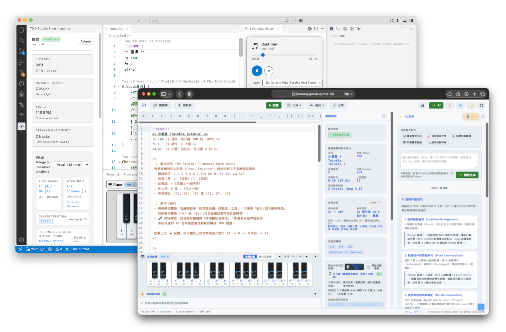

# TMD 音樂/樂隊電腦語言

In memory of Chen, Chih-Han / aguai (阿怪, 1974–2019)

TMD 是：

- 一種用來標示旋律的簡譜語法
- 跟這套語法相關的各種相關工具，包括編輯環境、格式轉換工具、語法檢查工具
- 一套讓心中的旋律，透過簡單的文字與 AI 協作，成為第一個可以試聽 MIDI 以及樂譜的工作流
- 一個希望能讓您寫出第一首自己的歌的環境

!!! tip
    如果您計畫開始寫第一首歌，可以先直接前往 **[TMD Studio](tmd_studio.md)** 章節。

## 給心中有旋律的人的 AI 中介語言

Suno、Udio、Google Flow Music…等用文字 prompt 直接產生音樂的 AI 工具已經相當普及，但都有一個共同問題—這些工具都是根據機率，直接產生一首歌曲最後的波形，最後會產生怎樣的內容其實難以預測，而且—**用的不是你的旋律**。

當你心中已經有一段旋律，你沒有辦法要求這些工具照你的旋律發展音樂。在產生歌曲之後，也很難做進一步的細部調整，像要求他保留副歌，但是重寫主歌，每一次都只能產生全新的內容。你也不能要求 AI 幫你合併兩首歌曲，成為一份規格更宏大的作品。

其實文字型的 AI，無論是 Gemini、ChatGPT、Claude 等，其實都有撰寫旋律、和弦的的能力，只要能夠將您的旋律變成文字 prompt，各種AI 模型就能夠和您一起完成一份樂譜。在 TMD 的編輯環境中，您可以手動或哼唱輸入一段旋律、轉換成 TMD 語法，即時試聽，然後轉換成 MIDI 或樂譜。

TMD 最早的創作者是寫出《三天三夜》的音樂人[陳志翰](https://zh.wikipedia.org/wiki/%E9%99%B3%E5%BF%97%E7%BF%B0)（阿怪），在 2016 年時為了自己記譜所做的語法（[原始專案](https://github.com/aguai/TMDLang)）。TMD 意指 Timebased Markdown 或 Textual Music Description。在阿怪來不及看到的 AI 時代中，TMD 突然有了不同的意義—人與 AI 間的理想音樂協作語言。

## 人類與 AI 的協作

我們想要的，往往不只是能用 AI 做出東西，而是一份人機協作的結果。

人機協作除了 AI 模型本身的能力外，還要加上人類自己使用 prompt 的能力，以及用來驗證 AI 結果的自動化檢查工具的能力。前者用來讓 AI 更能理解人類的意圖，後者用來確保 AI 的輸出符合期望。

這三者缺一不可，而且，需要一套三者之間的共同語言。一件作品的完成，中間會經歷多次修改，人類要有能力修改 AI 產生的內容，使用工具驗證，讓三者成為 loop。在 TMD 的工作流中—

| 角色           | 職責                                                                     |
| -------------- | ------------------------------------------------------------------------ |
| 人類           | 除了掌握基本風格參數外，也掌握核心的旋律                                 |
| AI 模型        | 協助人類繼續發展旋律與和弦                                               |
| 自動化檢查工具 | 用來驗證 AI 的輸出，如語法、格式是否正確，並且可以做音高、調性的自動檢測 |

接手阿怪 TMD 格式的開發者並非專業音樂工作者，開發這套工具，一大部分是他自覺有所謂的「耳蟲」，常常不自覺腦中就會冒出一段旋律，直到把這段旋律記下來，甚至成為完整作品，自己聽過那首歌之後，才能停止腦中的旋律。開發 TMD 工具的初衷，除了紀念阿怪這位朋友，也是解決自己遇到的問題。

## 和其他記譜文字格式比較

TMD 的特色是—使用相對音高、將歌曲段落模組化、內建簡化的轉調命令。帶來的效應是—大幅壓縮資訊量，用簡短的文字就能描述一首歌曲，在 AI 時代的好處就是除了節省 token，而且避免生成錯誤內容。

許多純文字的記譜語法都相當成熟，像是 MusicXML、LilyPond、ABC notation 等，AI 也有產生這些格式的能力，TMD 也無法替代這些格式所擅長的領域。

這些格式誕生的年代，人機互動的對象往往是印表機，是在樂曲完成之後，讓印表機可以印出精確的樂譜，供樂手閱讀與演奏。在 AI 時代，人機互動，變成了是與 AI 模型互動。在定位上，MusicXML、LilyPond 與 ABC notation 是為了樂手服務，TMD 則是紀錄最早的作曲意圖的筆記，我們也可以透過工具，將 TMD 轉換成上述各種格式。

MusicXML 與 LilyPond 雖然嚴謹，有大量樂譜採用這些格式，但語法複雜，在心中有旋律的創作初期，在輸入旋律時就有相當的負擔，讓 AI 產生樂譜後，人類要進一步修改也相對困難。

ABC notation 雖然語法較簡單，但一開始是為了紀錄固定音高的單軌旋律、最後轉成五線譜而生，在遇到有多個樂器的時候，需要分開紀錄每個樂器從頭到尾每個小節，遇到樂器是從某個小節才進入的狀況時，很容易產生大量的休止符—對 AI 來說，這些大量的休止符，也都是語法干擾，容易讓 AI 計算錯誤，導致樂器進入的時間不正確。

在 TMD 中，一首樂譜可以被切成多個段落，當某個段落中沒使用某種樂器時，可以完全不用寫，讓 AI 專心在真正需要注意的地方。

## 與音樂 Live Coding 的差異

近年來以程式碼即時演奏的 Live Coding（如 Sonic Pi、TidalCycles、Strudel、FoxDot 等）在電腦音樂圈也相當活躍。同樣是「用文字寫音樂」，TMD 與 Live Coding 在核心哲學、語法抽象層次與使用情境，都有著不同定位：Live Coding 是直接使用可運算、執行程式語言播放音樂，而 TMD 仍然守在音樂的 DSL 的範圍中：

| 比較維度 | TMD (Timebased Markdown) | 音樂 Live Coding (Sonic Pi / TidalCycles 等) |
| :--- | :--- | :--- |
| **核心定位** | **記譜與作曲筆記** | **即時演出與音訊合成** |
| **思維模型** | 宣告式結構（Declarative）：段落、小節、音符、和弦進程 | 演算法與程序式（Procedural）：Pattern 運算、音訊 DSP、合成器參數與迴圈 |
| **音高系統** | 簡譜相對音高（首調思維），專注於旋律記憶與調性轉移 | 絕對音高（MIDI 數值 / 音名）或頻率控制，強調音色調變 |
| **人機協同** | 對 **人 與 AI 語言模型** 的互動友善 | 為 **人與音訊引擎** 的現場即興演奏設計 |
| **產出結果** | 結構化樂譜、MIDI、MusicXML、簡譜，供後續編曲或打譜使用 | 即時音訊串流（Audio Stream）、即興聲響展演 |

- **Live Coding 關注「聲音的產生與即時變換」**：它本質上是可程式化的合成器與取樣機，適合現場即興、電子音樂表演與演算法聲響實驗。
- **TMD 關注「旋律與結構的精確記錄」**：它是一套極度輕量的「音樂 Markdown」，旨在以最低的心智負擔把腦海中的動機、旋律與段落記下，並讓 AI 能夠無縫理解、補全與修訂，最後再交由 DAW 或製譜軟體做進一步的製作。

## 使用文字創作音樂

使用純文字記譜，除了可以與 AI 協作外，還可以帶來

- 完整掌握、永久保存資料：就算日後 TMD 停止開發，因為是純文字，記下的樂譜仍然可以用一般的文字編輯器打開，不會被特定軟體綁死
- 跨平台：在任何 PC 上，只要有編輯器，都可以編寫 TMD。我們也提供 Web 的編寫環境，只要有瀏覽器就可以使用。
- 極致輕量：一首樂曲可能只有幾十行文字，除了在磁碟上存檔之外，各種網路筆記本軟體都可以輕易保存
- 複製貼上：如果要搬移或複製旋律，就只是像編輯文件一樣複製貼上，也可以將不同的歌曲段落或章節合併成完整的作品
- 搜尋：只要在相關段落上，寫上簡單的註解，就可以快速找到想要試聽或修改的段落
- 註解：可以在樂譜中加入註解，方便自己或他人理解每個段落的用途或特別注意的地方
- 音樂生成：對於會寫程式的用戶來說，只要寫文字生成的程式，就有自動化生成音樂的能力
- 版本控制：搭配 git 等版本控制系統，可以追蹤每一次修改，方便回溯與管理
- 多人協作：多位創作者可以同時編輯同一份樂譜，透過版本控制系統協調修改，提升協作效率—大家可以對一首歌發 PR

## 快速開始與文檔導覽

想開始體驗 TMD，您可以從以下章節逐步探索：

- **[TMD Studio](tmd_studio.md)**：網頁版編輯環境，支援瀏覽器即時試聽、AI 協同寫歌、哼唱轉譜與多種格式匯出。
- **[VS Code 套件](vscode.md)**：語法高亮、即時小節錯誤診斷、側邊欄歌曲分析器與 GitHub Copilot AI 整合。
- **[CLI 工具](cli.md)**：命令列樂譜解析、小節長度校驗、音訊預覽、轉檔與 AI Agent/MCP 整合。
- **[歌曲分析](inspector.md)**：歌手音域（Vocal Tessitura）、K-S 調性認知演算法與五度圈分析。
- **[AI 協同寫歌](ai_agent.md)**：五大人機協同模式、即時試聽除錯閉環與實用提示詞模板。
- **[Web MCP 設定](web_mcp.md)**：瀏覽器端 Model Context Protocol 服務、雙向編輯器同步與即時試聽整合。
- **[動機與變奏](motif_variation.md)**：電影感主導動機（Leitmotif）與四種場景氛圍變奏。
- **[創作大型作品](epic_composing.md)**：「分而治之」工作流，從場景腳本、動機發展到全曲拼裝。
- **[後期製作](production_workflow.md)**：串接 MuseScore、GarageBand、Logic Pro、REAPER 與頂級虛擬音色庫。
- **[演算法生成](algorithmic_music.md)**：TMD 巨集語言、費氏數列旋律、馬可夫鏈和弦與生命遊戲節奏。
- **[奇思妙想](creative_experiments.md)**：用生日、名字、詩詞平仄、RSA 加密與 Git Hash 激發靈感。
- **[語法規格](syntax.md)**：相對音高、段落宣告、拍號速度、轉調與打擊樂語法規格。
- **[開發者指南](developer.md)**：npm 套件 `tmdlang`、TypeScript API、AST、多格式匯出器與 MCP/LSP 整合。
- **[常見問答](faq.md)**：倍率 `<4*>` / `<8*>` 常見失誤、小節校驗抓蟲與 AI 自動修復技巧。
