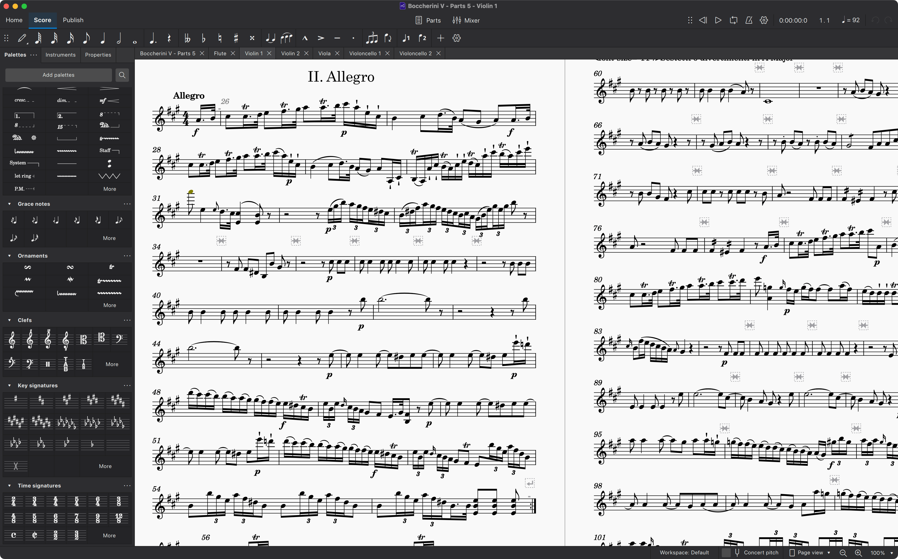
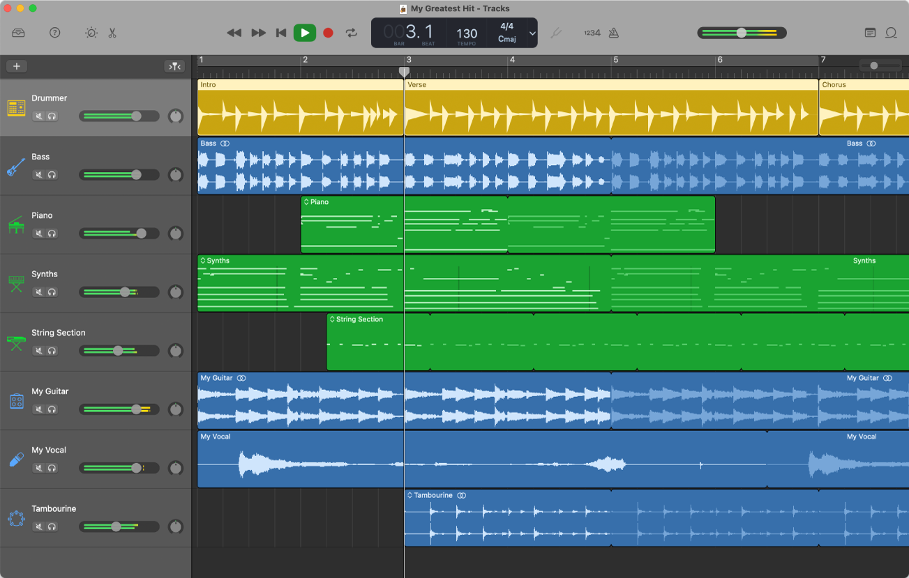
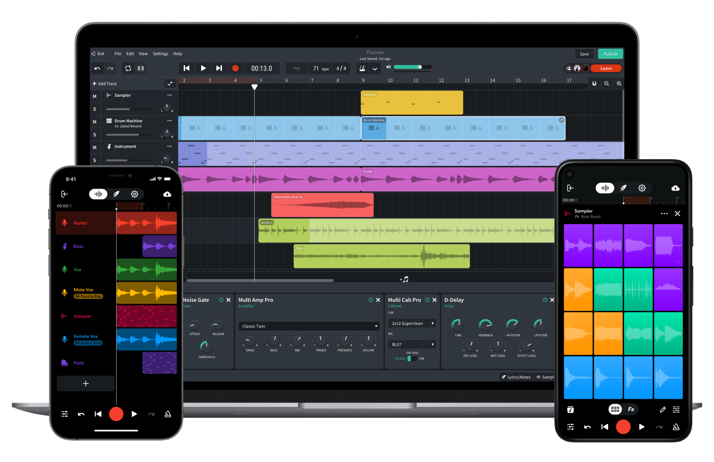
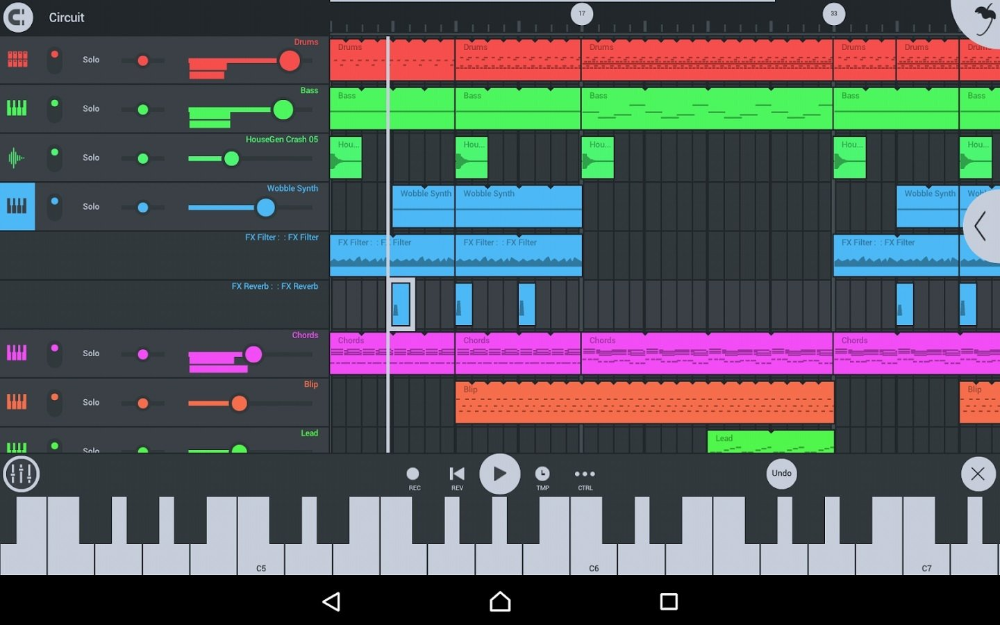

# 後期製作

在 TMD Studio 或命令列中編寫樂譜時，內建合成器播放的聲音主要用於確認音高、拍數與結構是否正確。

如果需要進一步進行五線譜排版、更換音色、混音或細修表情控制器，可以將 TMD 匯出的檔案整合至常見的製譜軟體與數位音訊工作站（DAW）。

## 1. 五線譜排版：MuseScore

如果需要產生供樂手排練、合唱團或樂團閱讀的標準五線總譜與分譜，可以使用開源排版軟體 **MuseScore**。



### 匯出與開啟流程

1. 在 TMD Studio 點選 `Export` ➔ **MusicXML 4.0 (`.musicxml`)**；或透過命令列匯出：

   ```bash
   tmd my_song.tmd -x my_song.musicxml
   ```

2. 開啟 MuseScore 4，載入該 `.musicxml` 檔案。
3. MuseScore 會解析 TMD 中的軌道配置、拍號、小節線、速度標記、動態強弱（如 `{p}`, `{f}`）與和弦代號，並自動完成五線譜排版。

### Muse Sounds 音色庫

MuseScore 4 支援透過 Muse Hub 下載管弦樂與合唱音色庫 **Muse Sounds**（包含弦樂、木管、銅管、打擊樂與合唱），可直接在排版介面中回放更自然的樂器發聲與連奏細節。

---

## 2. 蘋果平台：GarageBand 與 Logic Pro



macOS 與 iOS/iPadOS 內建或支援的音訊工具可直接讀取 TMD 產出的標準 MIDI 檔案。

### iOS / iPadOS：GarageBand

在行動裝置上使用 TMD Studio 匯出 MIDI 後，可匯入行動版 GarageBand：

1. **下載檔案**：在行動瀏覽器中點選 `Export` ➔ **MIDI (.mid)**，將檔案存至系統「檔案」App。
2. **匯入專案**：
   - 開啟 iOS GarageBand 並建立新歌曲。
   - 點選右上角「迴圈瀏覽器」圖示 ➔ 切換至「檔案」分頁。
   - 點選「從檔案 App 瀏覽項目」選取該 `.mid` 檔案，再將檔案拖曳至時間軸軌道區域。
3. **更換音色**：系統會將不同通道拆分為獨立軌道，可依需求指派內建軟體樂器或「聲音資源庫」音色。

### iPad：Logic Pro for iPad

在 iPad 上使用 Logic Pro，可直接開啟 GarageBand 專案或匯入 MIDI，進行多軌混音、插入效果器插件，或使用 Apple Pencil 繪製表情自動化曲線。

### macOS：GarageBand 與 Logic Pro

1. 將 TMD 匯出的 `my_song.mid` 拖曳至 Mac 版 GarageBand 專案視窗，系統會自動依通道建立獨立軌道。
2. 可將預設音色替換為內建錄音室樂器（如平台鋼琴、弦樂組）。
3. 如需進行更深入的混音、總線處理與母帶製作，可在 GarageBand 中選取 `檔案 ➔ 在 Logic Pro 中打開` 進行後續工程。

---

## 3. Android 平台：BandLab 與 FL Studio Mobile

Android 裝置同樣可透過支援 MIDI 匯入的音樂製作 App 處理 TMD 產出的檔案：

### BandLab



BandLab 是一套支援跨平台的雲端音樂製作工具：

1. **匯入 MIDI**：在行動瀏覽器下載 TMD 匯出的 `.mid` 檔案，開啟 BandLab 專案後點選 `+` ➔ `Import Audio/MIDI` 載入檔案。
2. **多軌編輯**：系統會自動拆分軌道，並可指派內建的各類軟體樂器與音效處理器。
3. **雲端同步**：專案會同步於雲端帳號，後續可在電腦端瀏覽器登入繼續編輯。

### FL Studio Mobile



FL Studio Mobile 支援多軌離線製作：

- **MIDI 匯入**：可直接載入 TMD 匯出的標準 MIDI 檔案至音軌。
- **採樣引擎與 SoundFont**：內建 DirectWave 採樣播放器，並支援載入外部 SoundFont（`.sf2`）音色檔。
- **電腦端互通**：手機端專案檔案可匯入桌面版 FL Studio 進行後續製作。

---

## 4. 數位音訊工作站：REAPER

REAPER 是一套跨平台的數位音訊工作站，適合處理複雜的多軌 MIDI 與外接 VST 外掛程式。

### TMD 原生匯出 REAPER 工程檔（`.rpp`）

TMD 支援直接產生 REAPER 工程檔案：

```bash
tmd my_song.tmd -r my_song.rpp
```

或在 TMD Studio 的匯出選單中選取 **REAPER Project (.rpp)**。

### 專案檔整合特性

相較於單純匯出通用 MIDI，TMD 產生的 `.rpp` 包含以下結構設定：

- **段落標記（Markers）**：TMD 中的段落名稱（如 `intro`、`verse`、`chorus`）會自動對應至 REAPER 時間軸上的標記。
- **速度軌（Tempo Map）**：樂譜中宣告的速度變更（`{!=...}`）與拍號會自動寫入 REAPER 速度軌。
- **軌道命名與 MIDI 區塊**：各聲部軌道與名稱已設定完成，使用者可直接在軌道上掛載音色插件。

### REAPER 的 MIDI 播放設定

REAPER 預設未內建通用 MIDI（General MIDI）軟體音源，因此未掛載插件前播放 MIDI 不會發聲。常見的解決方式如下：

1. **掛載 SoundFont 播放插件**：
   - 在軌道上載入免費的 SoundFont 播放插件（如 **Plogue sforzando**）。
   - 掛載標準 GM 音色檔（如 *GeneralUser GS* 或 *FluidR3 GM*），即可直接回放標準樂器聲音。
2. **儲存專案範本（Project Template）**：
   - 預先配置好常用樂器軌道（如鋼琴、弦樂、鼓組等音色插件），並透過 `File ➔ Project templates ➔ Save project as template` 儲存為範本。
   - 日後將 TMD 匯出的 MIDI 拖入範本專案，即可直接套用預設的音色與效果器配置。

---

## 5. 常見虛擬樂器音色庫（VSTi / Audio Units）

在 DAW 中製作管弦樂或樂隊伴奏時，可依曲風替換為專業採樣音色庫：

### 管弦樂與合奏

- **Spitfire Audio - BBC Symphony Orchestra**：
  - **BBC SO Discover**：基礎編制的管弦樂音色（弦樂、木管、銅管、打擊樂），資源佔用量低。
  - **BBC SO Core / Professional**：包含完整麥克風擺位與多種演奏法（Articulations）。
- **Spitfire Audio - Albion ONE**：提供大型管弦樂合奏、銅管與打擊樂齊奏音色，常應用於影視預告與配樂。

### 鍵盤樂器

- **Native Instruments - The Giant / Alicia's Keys**：直立鋼琴與平台鋼琴採樣音色庫。
- **Modartt - Pianoteq**：基於物理建模的鋼琴插件，非傳統大型採樣檔，磁碟佔用小且音色動態平滑。

### 貝斯與打擊樂

- **Spectrasonics - Trilian**：包含低音大提琴、電貝斯與合成貝斯的音色庫。
- **Toontrack - Superior Drummer 3 / EZdrummer 3**：多聲道多麥克風擺位的真實爵士鼓組採樣。

---

## 6. 表情控制器與空間處理

將 MIDI 匯入 DAW 後，可透過以下方式調整音符動態與空間分佈：

### 表情控制器（MIDI CC Automation）

長音聲部（如弦樂、銅管）若維持固定音量容易顯得呆板，可在 DAW 的 MIDI 編輯器中繪製連續控制器曲線：

- **CC1 (Modulation Wheel)**：常用於控制音色動態層次（如由暗轉亮）。
- **CC11 (Expression)**：控制聲部音量微調與漸強漸弱。

### 聲像（Panning）與空間殘響（Reverb）

- **立體聲方位分配**：
  - 依傳統管弦編制安排左右聲像：第一小提琴置於左側，大提琴與低音提琴置於右側，木管偏左，銅管偏右後方，定音鼓居中後方。
- **發送殘響（Send Reverb）**：
  - 在輔助軌（Aux/Bus）掛載空間殘響效果器，將各軌發送至同一殘響空間，使不同樂器的聲響環境保持一致。
