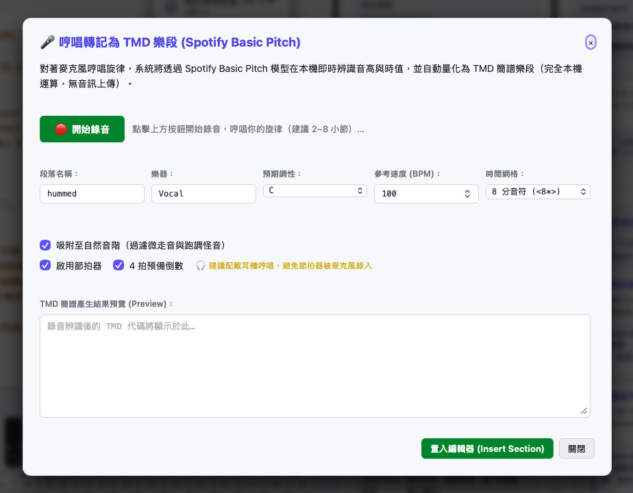
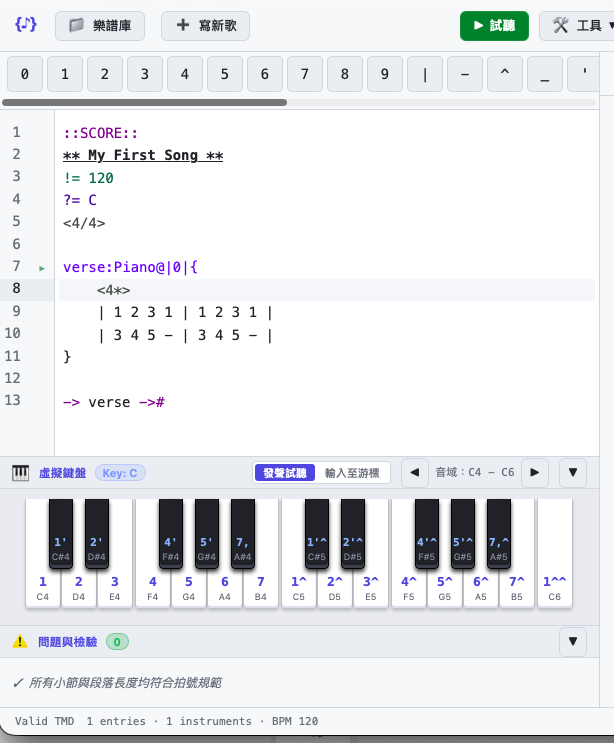
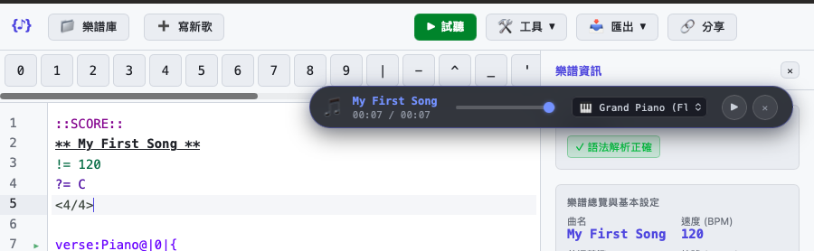
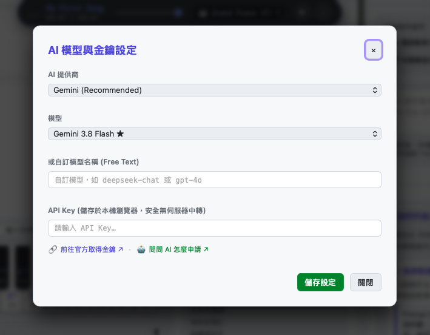
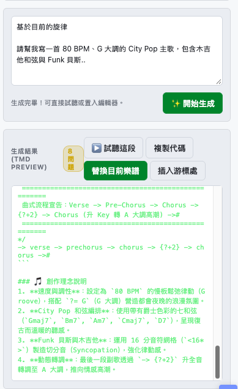
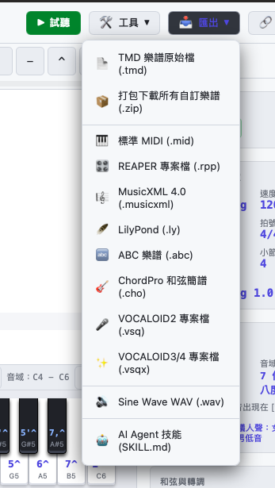

# TMD Studio

**網址**：[https://tmdlang.github.io/Tmd-TS/](https://tmdlang.github.io/Tmd-TS/)

**TMD Studio** 是專為瀏覽器打造的純文字音樂工作站。

無需安裝編譯器、DAW 或本機環境，打開瀏覽器即可編寫 TMD 樂譜、哼唱輸入旋律、試聽多軌合成音色，並將作品輸出為標準 MIDI、MusicXML、LilyPond 或音訊檔案。個人電腦、手機與平板皆可使用。

## 編輯區簡介

TMD Studio 的介面分為以下核心區域：


- **頂部工具列**：提供即時試聽播放、編曲重構工具、格式匯出選單與樂譜收藏庫抽屜。
- **純文字編輯器**：支援 TMD 專屬語法高亮、小節對齊、快捷鍵與自動補齊。
- **側邊檢查面板**：
    - **Problems 面板**：即時驗證每一小節拍數是否平衡，標示缺少或多出的拍數與所在行號。
    - **Inspector 面板**：即時分析主旋律音域範圍（最高音、最低音、跨越半音數），方便確認歌手音域；並統計各段落時長與編曲樂器密度。
- **AI 功能面板**：提供與 AI 協作的介面，支援自動配器、動機發展、和弦重配與語法檢查等功能。
- **樂譜管理面板**：顯示最近建立的樂譜，提供匯入、匯出與範例樂譜。

## 用哼唱輸入 TMD 段落



如果心中有旋律，卻不知道對應的簡譜音符與節奏，可使用 TMD Studio 的**哼唱轉譜（Hum to TMD）**功能：

1. 點擊頂部工具列的 **工具 🛠️** ➔ 選擇 **哼唱轉為樂段**。
2. 允許瀏覽器使用麥克風權限。
3. 對著麥克風清晰地哼唱或吹口哨一段 4～8 小節的旋律。
4. 錄音結束後，內建音高偵測演算法（Basic Pitch）會分析音高與節奏，轉換為符合 TMD 規格的簡譜音符與段落語法，插入編輯區供微調。

## 手動輸入 TMD 段落



在編輯區中，可從簡單骨架開始：

```tmd
::SCORE::
** My First Song **
!= 120
?= C
<4/4>

verse:Piano@|0|{
    <4*>
    | 1 2 3 1 | 1 2 3 1 |
    | 3 4 5 - | 3 4 5 - |
}

-> verse ->#
```

### 快速輸入技巧

- **簡譜直覺輸入**：鍵盤數字鍵 `1` 到 `7` 對應音級。
- **高低八度**：在音級後加上 `^`（高音點）或 `_`（低音點），如 `1^`、`5_`。
- **節奏延音**：使用連字號 `-` 延長拍子；`0` 輸入休止符。
- **小節線輔助**：隨時鍵入 `|` 方便視覺對齊，不影響節奏計算。

更多[語法](syntax.md)請見後文。

## 試聽全曲與段落



點擊頂部的 **播放 ▶**（或按 `Space`）即可在瀏覽器試聽合成聲音：

- **高品質內建音色**：支援 FluidR3 General MIDI 平台鋼琴、弦樂、吉他、貝斯與爵士鼓組。
- **段落單獨試聽**：在播放順序中改為 `-> chorus ->#`，即可單獨打磨該段落。
- **Web MIDI 硬體支援**：將 MIDI 訊號輸出至外部合成器或鍵盤。

!!! note
    受網頁限制，音色可能不理想；可下載 MIDI 後在 DAW 試聽。

## 使用 AI 協同創作

TMD Studio 內建純前端 AI 協作助手，可在瀏覽器連線大語言模型（如 OpenAI、Google Gemini、Anthropic Claude、DeepSeek 或本機 Ollama）。AI 能理解 TMD 語法，協助自動配器、發展動機、編配和弦與檢查語法。

### 步驟 1：在設定中輸入 API Key



1. 點擊頂部或側邊欄的 **AI 助理**（或點擊 AI 設定圖示 ⚙️）。
2. 在彈出的 **AI Provider & Key Settings** 設定視窗中：
   - 選擇你偏好的模型提供商（例如 Google Gemini、OpenAI、DeepSeek 或 Custom 自訂端點）。
   - 選擇模型版本（例如 `gemini-1.5-pro`、`gpt-4o` 等）。
   - 輸入你的 **API Key**。
   - 點擊 **Save Settings** 儲存。

!!! info
    API Key 僅保存在瀏覽器的本機儲存空間（Local Storage），請求直接由你的瀏覽器發出，完全不經過任何第三方中繼伺服器，安全且具隱私性。如有疑慮，您可以查看 [TMD Studio 的原始碼](https://github.com/TMDLang/Tmd-TS)，或是自行部署。

### 步驟 2：在 AI Panel 的 Editor 中用 Prompt 提出需求

設定完成後，展開 **AI Assistant** 面板：



- 你可以在輸入框中以自然語言 Prompt 告訴 AI 你需要的協助，例如：
    - **全曲創作**：「請幫我寫一首 80 BPM、G 大調的 City Pop 主歌，包含木吉他和弦與 Funk 貝斯...」
    - **自動配器**：「這是我的主旋律，請幫我加上 Piano 和弦伴奏，並在第 2 小節讓 Drums 進場...」
    - **動機發展**：「這是 2 小節動機 `1 2 3 5 | 6 5 3 -`，請使用問答句式延伸成 8 小節完整的段落...」
    - **和弦重配**：「請將目前的流行 1-5-6-4 和弦改編為帶有副屬和弦的爵士風格...」
- 點擊 **Generate ✨**（或使用面板頂部的 Quick Action 快速捷徑按鈕），AI 即會以串流方式生成符合 TMD 語法的樂譜。

### 步驟 3：預覽與更新編輯區

生成後，AI Panel 會提供預覽與驗證結果：

- **獨立試聽（▶️ Preview This）**：套用前先試聽 AI 生成的段落。
- **更新編輯區**：
    - **Replace Current Score**：將生成的樂譜覆蓋更新至主要編輯區。
    - **Insert at Cursor**：將生成的伴奏軌道或延伸小節插入在游標所在位置。
- **自動除錯修復（Ask AI to Fix）**：若小節時值有落差，面板會顯示錯誤提示與 **🔧 Ask AI to Fix** 按鈕，點擊後 AI 會重新計算並修正。

!!! note
    若需要復原編輯操作，可隨時使用 Ctrl + Z 或 Command + Z。

## 轉換成 MIDI 與樂譜（多格式匯出）

點擊頂部工具列的 **Export 📥**，即可轉換並下載作品：



- **Standard MIDI (`.mid`)**：匯入 Logic Pro、Cubase、Ableton Live、FL Studio 或 GarageBand 進行編曲與混音。
- **REAPER 專案檔 (`.rpp`)**：產生 REAPER 多軌工程檔，軌道與小節自動定位。
- **MusicXML 4.0 (`.musicxml`)**：匯入 MuseScore、Sibelius 或 Finale 排版五線譜與總譜。
- **LilyPond (`.ly`)**：產生出版級樂譜原始碼。
- **ABC Notation (`.abc`)**：適用於網頁簡譜／五線譜渲染。
- **人聲合成專用格式**：
    - **VOCALOID (`.vsq`, `.vsqx`)**：匯入 VOCALOID 編輯器進行虛擬歌手填詞與調校。
    - **UTAU / OpenUtau (`.ust`)**：支援開源人聲合成軟體工程格式。
- **WAV 音訊檔**：在瀏覽器中離線渲染音訊檔案。

## 編輯區自動補齊與快捷功能

TMD Studio 內建語法補齊與輔助熱鍵：

- **格式化樂譜（Format Document）**：按下 `Cmd/Ctrl + Shift + F`，自動縮排段落、對齊小節線並整理多餘空白。
- **自動補齊（Auto-Completion）**：
    - 輸入段落名稱或軌道時提示已有的樂器清單。
    - 輸入和弦括號 `[` 時列出常用和弦（如 `[Cmaj7]`, `[Am7]`, `[6m]` 等）。
    - 輸入播放順序 `->` 時列出檔案中所有已定義的段落名稱。

## 8. 重新編排與編曲工具

**工具 🛠️** 選單提供多項編曲重構功能：

- **細分節奏網格（Subdivide Grid: `<4*>` ➔ `<8*>`）**：將段落中的音符時值等比放大，便於填入十六分音符或裝飾音。
- **壓縮節奏網格（Compress Grid: `<8*>` ➔ `<4*>`）**：將網格解析度減半。
- **樂譜／選取區移調（Transpose）**：將指定段落或整首歌曲升降半音。
- **複製軌道（Duplicate Track）**：複製現有軌道至新樂器，建立聲部疊音或合音。
- **自動生成平行和聲（Generate Harmony）**：選取旋律後產生三度或六度平行副旋律。
- **展開播放順序（Inline Orders to Linear Score）**：將包含反覆與轉調的播放順序展開為線性排列的連續樂譜。
- **重新命名與單軌抽出（Rename / Extract Instrument）**：批次修改樂器名稱，或單獨將特定樂器抽出成獨立樂譜檔案。

如果有程式開發經驗，可將這些工具視為重構（Refactoring）工具。TMD 以文字表達樂譜，也可視為能編譯成 MIDI、MusicXML 等格式的程式語言，能像修改程式碼一樣修改 TMD 檔案。
