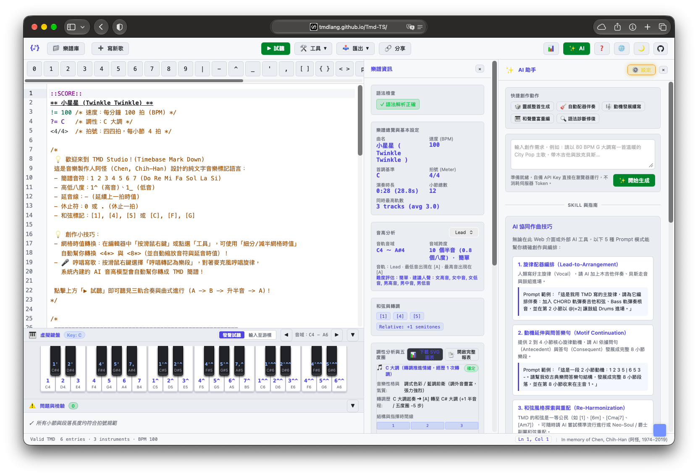

# Web MCP 設定

Model Context Protocol（MCP）是由 Anthropic 發起的開放標準協議，允許 AI 代理程式掛載專屬工具。

除了命令列本機的 stdio MCP 外，**TMD Studio 網頁版**（[https://tmdlang.github.io/Tmd-TS/](https://tmdlang.github.io/Tmd-TS/)）原生內建了 **Web MCP** 服務。

Web MCP 的核心設計方向是：**讓創作者使用本機現有的 AI 工具（如 Google Antigravity、Claude Desktop、Cursor、Windsurf 或 Claude Code 等）直接遠端操作瀏覽器裡的 TMD Studio。**

---

## 為什麼使用 Web MCP？（免在網頁中輸入 API Key）

在 TMD Studio 中使用內建的 AI 助手時，使用者需要在瀏覽器設定中填入個人的模型 API Key（如 OpenAI、Gemini 或 Anthropic API Key）。

但透過 **Web MCP**，這個工作流程有了徹底的改變：

1. **零 API Key 負擔**：AI 模型與對話直接在您的本機 AI 環境（如 Antigravity CLI、Cursor、Claude Desktop）中運行，**完全不需要在 TMD Studio 網頁中輸入任何 API Key**。
2. **使用更強大的本地 Agent 生態**：您可以直接享有本機 AI 助手擁有的完整能力（例如自訂 System Prompts、Skills、專案上下文、長思考模型等）。
3. **雙向操作網頁編輯器**：本機 AI 工具能直接「看見」目前網頁編輯器裡的樂譜（`getCurrentScore`），並在完成修改後「直接寫回」編輯區並觸發播放（`loadScoreToEditor`）。
4. **即時試聽反饋**：寫入後立即調用瀏覽器 Web Audio 播放試聽，讓 AI 生成與聽感確認形成無縫閉環。

---

## Web MCP 開放之工具清單

TMD Studio 在瀏覽器端註冊了以下 6 項標準工具：

| 工具名稱 | 說明 | 輸入參數 | 回傳內容 |
| :--- | :--- | :--- | :--- |
| `getTmdSkill` | 取得 TMD 語法規格、樂理記譜指引與 Prompt 編寫手冊 | 無 | 完整的繁體中文/英文 Prompt 提示詞指引（Markdown） |
| `parseTmd` | 解析 TMD 樂譜，回傳曲名、BPM、調性、拍號、樂軌摘要與語法錯誤 | `text` (樂譜字串) | 結構化 JSON 元數據或語法診斷訊息 |
| `checkTmd` | 靜態校驗每一小節的時值與拍數一致性 | `text` (樂譜字串) | 驗證通過狀態（`valid: true`）或具體出錯的小節、行號與相差拍數 |
| `convertTmd` | 將樂譜轉換為指定目標格式 | `text`, `format` (`midi`, `musicxml`, `lilypond`, `abc`, `reaper`, `chordpro`) | 轉換後的字串或 Base64 編碼（MIDI） |
| `getCurrentScore` | 取得目前 TMD Studio 編輯器中開啟的樂譜內容 | 無 | 編輯器中的完整 TMD 純文字 |
| `loadScoreToEditor` | 將樂譜文字推入 TMD Studio 編輯器中，並可選擇是否立即播放 | `text` (樂譜字串), `play` (布林值，可選) | 載入成功訊息 |

---

## 連線方式與操作步驟

TMD Studio 的 Web MCP 採用開源的 [WebMCP (https://webmcp.dev/)](https://webmcp.dev/) 規範。您不需要另外安裝瀏覽器插件，只需在本機的 MCP 設定中加入 WebMCP Server，即可透過 Token 與網頁端配對連線。

> [!IMPORTANT]
> **本機環境需求**：由於 WebMCP 伺服器是透過 `npx` 執行，**您的本機電腦必須先安裝 [Node.js](https://nodejs.org/)（建議 LTS 版本，內建 npm 與 npx 指令）**。若尚未安裝，可至 Node.js 官方網站下載安裝，或在 macOS 上透過 `brew install node` 安裝。



### 步驟 1：在本地 AI 客戶端設定 WebMCP Server

在您的本機 AI 工具設定檔（例如 **Claude Desktop** 的 `claude_desktop_config.json`，或 **Antigravity / Gemini CLI** 的 `mcp_config.json`，或 **Cursor** 的 `mcp.json`）中加入：

```json
{
  "mcpServers": {
    "webmcp": {
      "command": "npx",
      "args": [
        "-y",
        "@jason.today/webmcp@latest",
        "--mcp"
      ]
    }
  }
}
```

> **提示**：儲存設定後請重新啟動您的本地 AI 工具（如重啟 Claude Desktop 或重新載入 Agent session）。

### 步驟 2：向本機 AI 索取連線 Token

啟動您的本機 AI 助手（例如在 Antigravity 或 Claude Desktop 對話中），直接輸入：

> 「請幫我產生一個 WebMCP token（make a webmcp token）」

AI 代理程式便會呼叫 WebMCP 伺服器並回傳一串連線 Token。

### 步驟 3：在 TMD Studio 中貼上 Token 連線

1. 打開 [TMD Studio](https://tmdlang.github.io/Tmd-TS/)。
2. 點擊網頁右下角的 **WebMCP 藍色方塊圖示** 展開面板。
3. 將剛才取得的 Token 貼入 **Paste connection token** 輸入框。
4. 點擊 **Connect**。

連線建立後，Widget 狀態指示燈將轉為綠色。此時本機 AI 工具便可直接呼叫上述 6 個工具，隨心所欲地控制網頁編輯區！

> [!TIP]
> - 連線在閒置 5 分鐘後會自動斷開以保護資源，點擊 Connect 即可重新連接。
> - 若連線成功後客戶端尚未列出新工具，可重啟一次本地客戶端讓工具清單即時刷新。

## 本機 stdio MCP 與 Web MCP 的定位比較

TMD 提供了兩種 MCP 運作型態，您可以依照工作情境自由選擇：

| 比較維度 | 本機命令列 MCP (`tmd --mcp`) | 瀏覽器 Web MCP (TMD Studio) |
| :--- | :--- | :--- |
| **運作環境** | 本機 Node.js / CLI (stdio 管道) | 瀏覽器 JavaScript (WebSocket 橋接) |
| **適用客戶端** | 本機 Agent (Claude Desktop、Cursor、Gemini CLI) | **同上，本機 Agent 直接操作瀏覽器** |
| **網頁端 API Key** | **不需要** | **完全不需要在網頁輸入 API Key**（直接複用本機 LLM） |
| **安裝門檻** | 需要本機安裝 Node.js / `npm install -g tmdlang` 或 `brew` | 網頁端**零安裝**；本機需有 **Node.js (npx)** 供 MCP 客戶端啟動 WebMCP |
| **編輯器互動** | 讀寫本機硬碟檔案（`.tmd`, `.mid` 等） | **直接讀寫網頁編輯器畫面**，支援網頁端即時播放 |
| **音訊預覽** | 依賴本機音訊渲染為 `.wav` 檔案 | 瀏覽器內建 Web Audio 合成器直接發聲試聽 |

## 實戰範例：AI 代理人透過 Web MCP 協同創作

當 AI Agent 連上 TMD Studio 的 Web MCP 後，典型的對話流程如下：

```
人類：「請幫我看看目前編輯器裡的歌，幫我檢查有沒有拍數錯誤，然後把和弦換成爵士風格並試聽。」
```

AI Agent 在背後的運作：

1. 呼叫 `getCurrentScore()` 讀取網頁目前內容。
2. 呼叫 `checkTmd({ text })` 檢驗現有小節拍數。
3. 根據音樂理論修改 `CHORD` 軌道，換上副屬和弦與九和弦（如 `[Cmaj9]`、`[Am7]`、`[2m7-5]`）。
4. 再次呼叫 `checkTmd({ text: newText })` 確認修改後的拍數完全吻合。
5. 呼叫 `loadScoreToEditor({ text: newText, play: true })` 將新譜即時寫入網頁並自動開起試聽！
